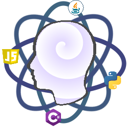

<!-- PROJECT SHIELDS -->
<!--
*** I'm using markdown "reference style" links for readability.
*** Reference links are enclosed in brackets [ ] instead of parentheses ( ).
*** See the bottom of this document for the declaration of the reference variables
*** for contributors-url, forks-url, etc. This is an optional, concise syntax you may use.
*** https://www.markdownguide.org/basic-syntax/#reference-style-links
-->
[![License: MIT][license-shield]][license-url]
[![LinkedIn][linkedin-shield]][linkedin-url]

<!-- PROJECT LOGO -->
<br />
<p align="center">
  <a href="https://github.com/mvelasquez10/ck-frontend">
    
  </a>
  <h3 align="center">Collective Knowledge - Frontend</h3>
  <p align="center">
    This is the repository for the frontend of my profile's project, for more information please visit 
    <a href="https://mvelasquez.net"><strong>Miguel Velasquez</strong></a>
  </p>
</p>

<!-- TABLE OF CONTENTS -->
## Table of Contents

* [About the Project](#about-the-project)
  * [Built With](#built-with)
* [Getting Started](#getting-started)
  * [Prerequisites](#prerequisites)
  * [Installation](#installation)
* [Usage](#usage)
* [License](#license)
* [Contact](#contact)


<!-- ABOUT THE PROJECT -->
## About The Project
This is the frontend project for the Collective Knowledge which is a profile’s demonstration application. The focus of this project is to show the implementation of this side of the project to anyone who want to dig deeper into the features implemented.
### Built With

* [React](https://reactjs.org/)
* [Redux](https://redux.js.org/)

<!-- GETTING STARTED -->
## Getting Started

To get a local copy up and running follow these simple steps.

### Prerequisites
You need to install node.js to build the solution
* [Node.js](https://nodejs.org/en/)

### Installation

1. Clone the repo
```sh
git clone https://github.com/mvelasquez10/ck-frontend.git
```
2. Restore the packages
```sh
npm install
```
3. Configure the path to the service
```sh
sed -i src/services/ck.js 's+localshot+<url-to-the-service>+g'
```
4. Run the static server
```sh
npm start
```

<!-- LICENSE -->
## License

Distributed under the MIT License. See `LICENSE` for more information.

<!-- USAGE -->
## Usage
For a complete guide please visit [Miguel's Velasquez](https://mvelasquez.net)

<!-- CONTACT -->
## Contact

Author: [Miguel Velasquez][linkedin-url]

Project Link: [Collective Knowledge - Backend](https://github.com/mvelasquez10/ck-frontend)

<!-- MARKDOWN LINKS & IMAGES -->
<!-- https://www.markdownguide.org/basic-syntax/#reference-style-links -->
[license-shield]: https://img.shields.io/badge/License-MIT-green.svg?style=flat-square
[license-url]: https://github.com/mvelasquez10/ck-frontend/blob/master/LICENSE.txt
[linkedin-shield]: https://img.shields.io/badge/-LinkedIn-black.svg?style=flat-square&logo=linkedin&colorB=555
[linkedin-url]: https://linkedin.com/in/mvelasquez10
